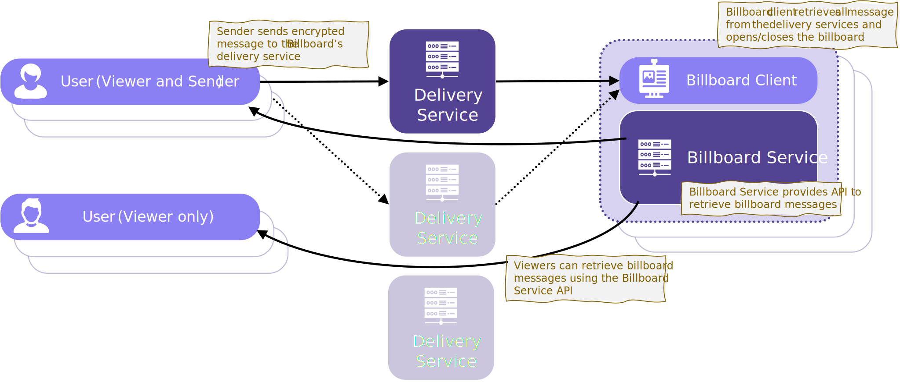
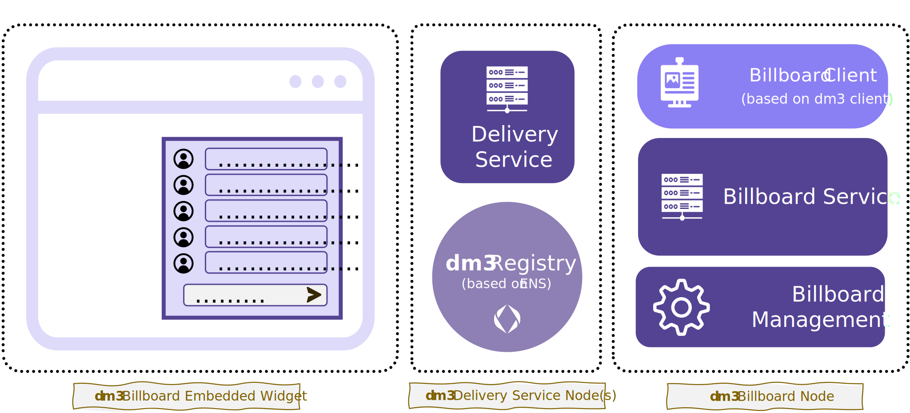

# Architecture

Billboard messaging is based on the [**dm3 Message Transport Protocol (DM3MTP)**](../message-transport/mtp-transport.md) with some particular extensions:

* **Billboard client:** This client is a special implementation of a [**dm3** client](bmp-node.md). Using the **dm3 Message Access Protocol (DM3MAP)** messages are retrieved from one ore several delivery serivees. Received messages are stored in a merged conversation (all received messages), ordered by a time of reception.
* **Billboard service:** The billboard service provides an [API](bmp-service-api.md) to access the messages from the billboard and additional functions. Since the messages are visible to all in the form of a bulletin board (depending on the operation mode), the entire communication can be retrieved from this service. The transmission is not encrypted.
* **Billboard embedded component:** The embedded component visualizes the billboard (messages) and enables message sending. This UI components can be integrated in existing dApps with minimum effort. Also, it provides an interface for moderators to block inappropriate statements. It is flexible configurable to meet different use-cases.
* **Delivery Service API extenstion:** The delivery service attached to the billboard client uses an extension to **DM3MAP**, the **dm3** message access protocol, to fetch the messages (not devided in conversations).

## Message Flow

1. Statements are added to the conversation by any participant via direct message to the billboard. To do this, the participant sends a message directly to one of the billboard's delivery services (**dm3** standard, using [**DM3MTP**](../message-transport/mtp.rst)).
2. The billboard client fetches incoming statements from the delivery service(s). The client stores the collected statements.
3. Viewers of the billboard conversation retrieve the billboard messages (list of statements) using the [**billboard service API**](bmp-service-api.md). Viewers can be active (send and view statements) or passive (view only).

## Components

The billboard message extension consists of the following components:

* **Delivery Service(s):** These service(s) receive the messages/statements. The delivery serivce implements the dm3 message access protocol with the billboard extension to access all messages (not separated into conversations).
* **Registry:** The **dm3** registry based on ENS.
* **Billboard Node:**
  * **Billboard Client** The dm3 client receiving and managing messages.
  * **Billboard Service** The cloud service providing access to the billboard's messages.
  * **Billboard Management Backend:** This service provides all functions needed to administrate the billboard, like configuration management, creation of billboards, management of ENS subdomains for virtual profiles (including CCIP integration into ENS Subdomain).
* **Billboard Embedded Widget** The UI component to be embedded in the app.

## Moderation of the Conversation

For regulatory reasons and the need for the billboard operator to block inappropriate comments to ensure proper conversation, each billboard service may be defined a list of moderators/mediators who exercise the right and duty to delete inappropriate comments and, if necessary, block users who repeatedly defy the rules.

For this purpose, the billboard serivce provides appropriate functions (see [API](bmp-service-api.md) that can be called up by the mediators.

If a sender repeatedly sends messages that need to be deleted, the mediator can also ban this sender. This means that the sender is blacklisted from the delivery service, so that no more messages can be received from him. For this purpose the spam protection rules of DM3MTP are applied.