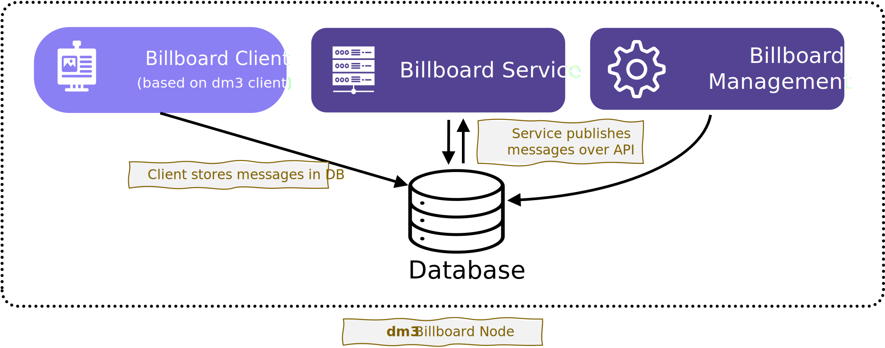

# Billboard Node

The **Billboard Node** is a collection of connected services. It is realized as a cloud service.

## Billboard Client

The **Billboard Client** is a hosted service that fetches messages directed to it as statements from the corresponding delivery service(s) using the extended **dm3 Message Access Protocol (DM3MAP)** and collects them as a list of statements. The messages are not managed as separate conversations with individual participants, but as a list of statements sorted by the time they were received.

Each billboard has it's own ENS name with **dm3** profile. This can be a subdomain where data is organized off-chain and linked using [CCIP](https://chain.link/cross-chain) (Cross Chain Interoperability Protocol) or it can be a separated ENS domain with a published **dm3** profile.

The client is designed to receive the statements only, as it does not send direct responses to the participants. It serves as database for the billboard service which provides the [API](bmp-service-api.md) to access the messages.

### Database

The database of the billboard client contains all messages received from any sender. As moderators can delete/block messages, entries in this database must be markable as deleted. This is done by storing the signature of the moderator who blocked the message. All messages without this blocking information are published.

## Billboard Service

The Billboard service is the interface to the viewers. It provides the [API](bmp-service-api.md) to access the statements which the viewer uses to retrieve the communication.
A Billboard Service can manage a number of intepended billboards. For example, a billboard server can host all billboards of an organization or an event.

The messages/statements can be retrieved using the REST API. The messages are delivered paged, in reverse order (from newest to oldest). Also, it is possible to use websocket connection to fetch new incoming messages.

## DM3MAP Extension

The **dm3** Message Access Protocol (DM3MAP) defines the standardized way to retrieve messages in conversations (with sender and receiver) from a delivery service. As billboard messaging is fully *dm3* compatible, the billboard client could retrieve messages packaged in conversations from the delivery service. For reasons of effectiveness, an additional API function is added for the billboard client, which provides the messages of all conversations for one receiver.

### Methode

tbd.

### Request

tbd.

### Response

tbd.

## Scaling

A billboard can use one or more delivery services. Depending on the expected number of statements to be received simultaneously, one or more fallback delivery services might be defined. If one is overloaded automatically the next will take over (already defined on protocol level for direct messaging).

The scaling of the billboard service can be sufficiently realized by common web2 load balancing techniques, so that enough bandwidth is available for all viewers. Caching of the current information is also essential on the server side.
