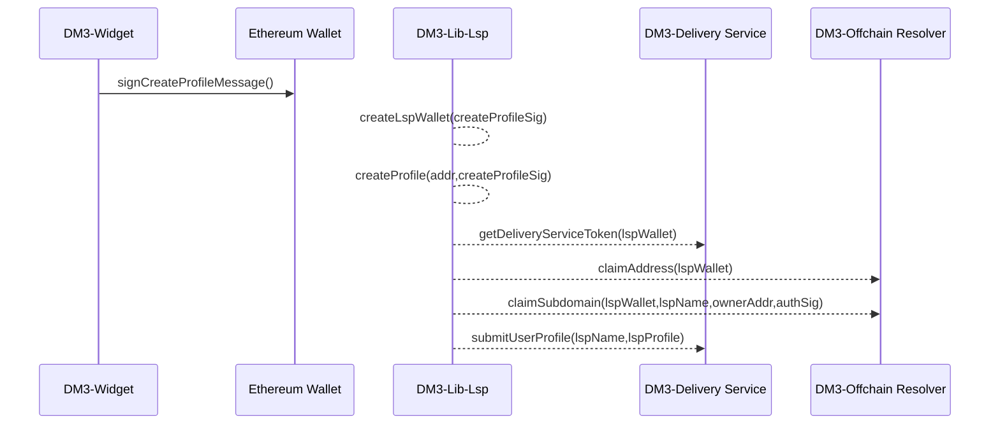

```mermaid
  sequenceDiagram

    participant DM3 as DM3-Widget
    participant W as Ethereum Wallet
    participant LIB as DM3-Lib-Lsp
    participant DS as DM3-Delivery Service
    participant OR as DM3-Offchain Resolver

    DM3 ->> W: signCreateProfileMessage()
    LIB-->LIB:createLspWallet(createProfileSig)
    LIB-->LIB:createProfile(addr,createProfileSig)
    LIB-->>DS: getDeliveryServiceToken(lspWallet)
    LIB-->>OR: claimAddress(lspWallet)
    LIB-->>OR: claimSubdomain(lspWallet,lspName,ownerAddr,authSig)
    LIB-->>DS: submitUserProfile(lspName,lspProfile)

```
