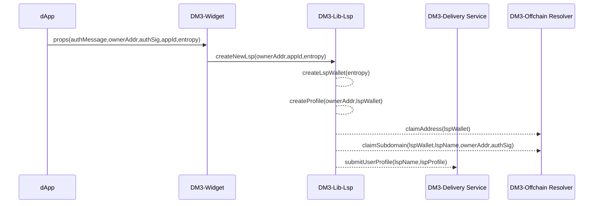

```mermaid
  sequenceDiagram
    participant DAPP as dApp
    participant W as DM3-Widget
    participant LIB as DM3-Lib-Lsp
    participant DS as DM3-Delivery Service
    participant OR as DM3-Offchain Resolver

    DAPP ->> W: props(authMessage,ownerAddr,authSig,appId,entropy)
        W->>LIB: createNewLsp(ownerAddr,appId,entropy)
        LIB-->LIB:createLspWallet(entropy)
        LIB-->LIB:createProfile(ownerAddr,lspWallet)
        LIB-->>OR: claimAddress(lspWallet)
        LIB-->>OR: claimSubdomain(lspWallet,lspName,ownerAddr,authSig)
        LIB-->>DS: submitUserProfile(lspName,lspProfile)

```
