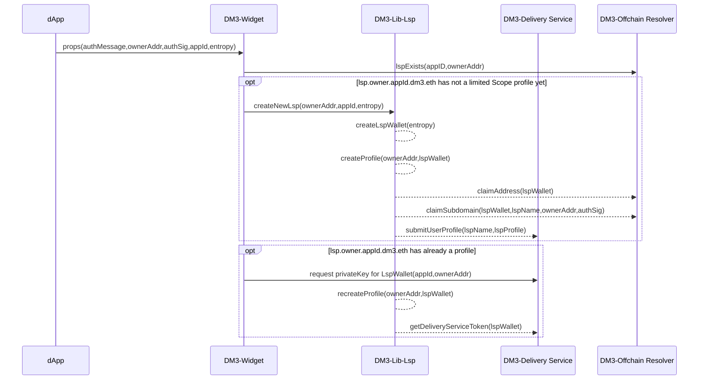

```mermaid
  sequenceDiagram
    participant DAPP as dApp
    participant W as DM3-Widget
    participant LIB as DM3-Lib-Lsp
    participant DS as DM3-Delivery Service
    participant OR as DM3-Offchain Resolver

    DAPP ->> W: props(authMessage,ownerAddr,authSig,appId,entropy)
    W->>OR: lspExists(appID,ownerAddr)
    opt lsp.owner.appId.dm3.eth has not a limited Scope profile yet
        W->>LIB: createNewLsp(ownerAddr,appId,entropy)
            LIB-->LIB:createLspWallet(entropy)
            LIB-->LIB:createProfile(ownerAddr,lspWallet)
            LIB-->>OR: claimAddress(lspWallet)
            LIB-->>OR: claimSubdomain(lspWallet,lspName,ownerAddr,authSig)
            LIB-->>DS: submitUserProfile(lspName,lspProfile)
    end
    opt lsp.owner.appId.dm3.eth has already a profile
    W ->> DS: request privateKey for LspWallet(appId,ownerAddr)
    LIB-->LIB:recreateProfile(ownerAddr,lspWallet)
    LIB-->>DS: getDeliveryServiceToken(lspWallet)
    end

```
