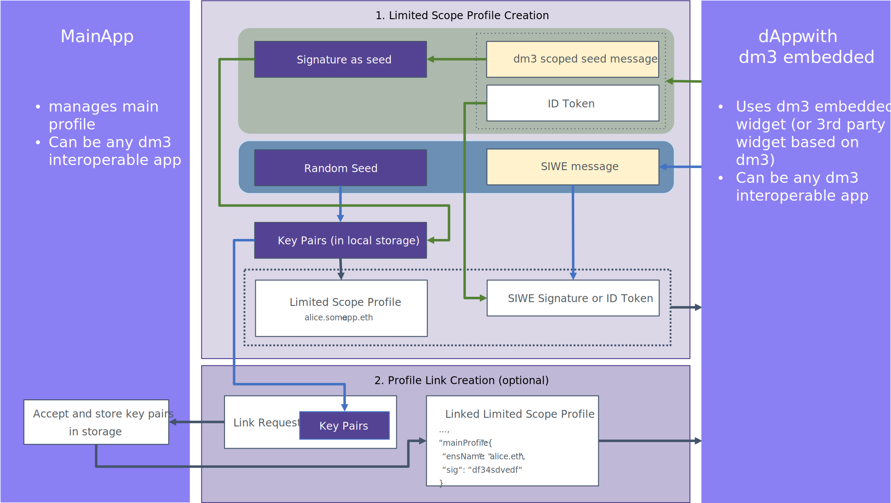

# Overview

For certain use cases, it is required to create standalone profiles that can optionally be linked and synchronized with the main profile. For example, a dApp could use integrated in-app messaging, or a website could allow direct contact with designated persons. This is done via the embedded **dm3** component.

Eventually, it might be desirable for a user to be able to send a message anonymously, but also, users should be able to write a message from the embedded messaging widget independently of their actual messenger app, which is then optionally also synchronized with their inbox.

In addition, security considerations may require the use of limited scope profiles with their own keys.

## Workflow

### Create Limited Scope Profile

