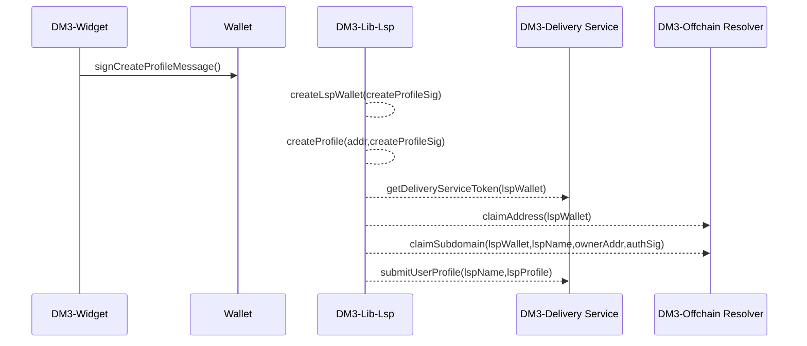
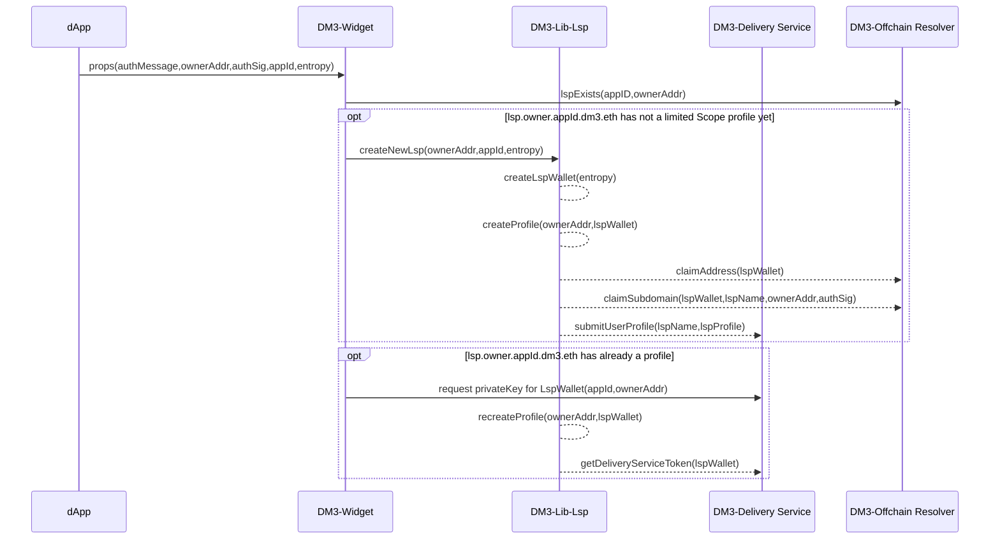
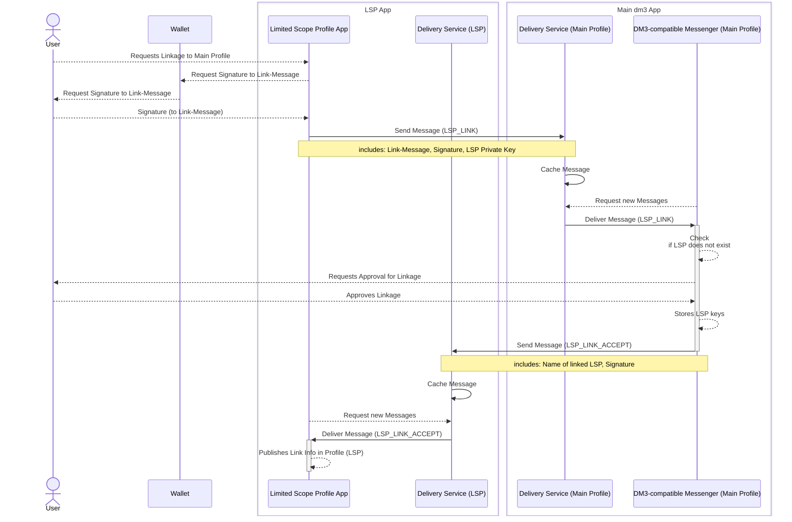
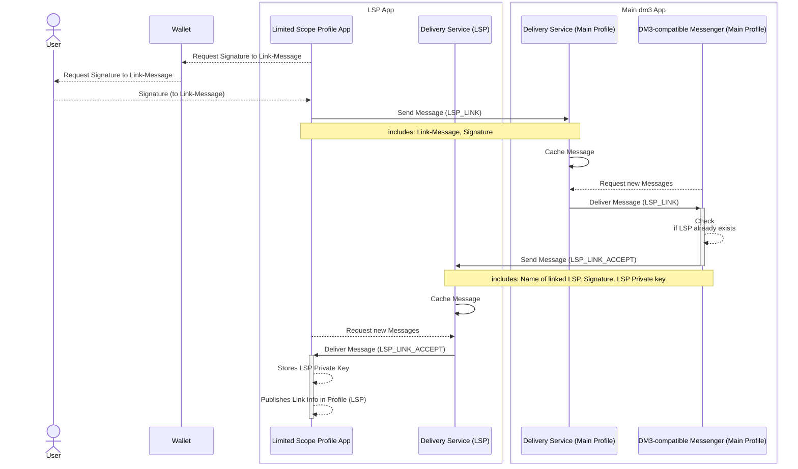

# Limited Scope Profiles

## What are limited Scope Profiles

In many applications, embedded messaging components are used so that users can exchange messages with each other, or users can get in touch with the app team or similar. With **dm3 embedded widgets** such a component is available, which is fully integrated into the **dm3** ecosystem.
Communication in these applications should often be anonymous, i.e. users come to this page and want to start immediately without going through an elaborate authentication process. In addition, it should be possible to link this communication to the user's inbox (any **dm3-compatible** messenger) if necessary, and also to ensure that the communication keys for encryption and signatures do not have to be shared with potentially risky dApps at any time.

**Limited Scope Profiles (LSP)** are local communication profiles that are created for a specific application and meet the above requirements. LSP provide:

* **Security:** Having different keys for different apps.
* **Interoperability:** LSP enable any embedded component to link with the user's main messenger (dm3-compatible messenger).
* **Self-sovereignty:** The users decide, if they want to connect these profiles to their inbox or not.

## Create Limited Scope Profile

To create an LSP, two approaches to create the communication keys are possible:

1. A unique message is provided and signed by the wallet's key. The keys are derived from this signature.
2. The message and signature are provided by the embedding app (for example, if Sign-in-with-Ethereum (SIWE) is used). Then the signature cannot be used as seed for deriving the key. The keys are then derived from a random entropy.[^1]

[^1]: The use of the signature as a seed is only permitted if the signed message is generated exclusively within the application (embedded component) and is used exclusively for this purpose (e.g. a special message is generated including a non-guessable nonce for which a signature is requested with the wallet key). If this message including signature is provided by the application in which the messaging component is integrated (e.g. when using SIWE), it must not be used as seed, otherwise the keys derived from it are not secure. In this case, the seed for the keys must be randomly generated with sufficient entropy.

Based on these keys and the address of the wallet a **dm3** profile is created. For this purpose, the dApp that uses the messaging component, SHOULD also operate one or more delivery service nodes.
The profiles are given a virtual ENS name which is the wallet address as subdomain of the ENS name of the dApp, which is used to publish this profile. This is usually provided via CCIP (Cross Chain Interoperability Protocol), so that the information is managed cost-effectively by a cloud service or in Layer-2.

> **Example** of a virtual name for the dm3 profile :
>
> ```JavaScript
> 0x1234...789.addr.myapp.eth
> ```

### Workflow to create a LSP by signing a message:



### Workflow to create an LSP embedded in  another dApp



## Usage of the Limited Scope Profile

Once the LSP is created, it can already be used like any other **dm3** profile. Users can send and receive messages.

These profiles are already connected to the wallet address, but have no connection to an existing **dm3** profile. So it is now possible to run an anonymous profile.

The effort for users to onboard is minimal, so that the creation of LSP can be effectively integrated into dApps. At most a signature of the wallet is needed if a custom message is used. When using SIWE or similar, the creation can be done completely in the background without any user interaction.

From the user's point of view, it may be desirable to have such a communication without a connection to his main profile (or at least to start the communication that way). Especially when the user does not know how much he can trust the application, there is a need to first disclose as little information as possible and still have a secure communication.

Possible applications for anonymous profiles:

* In-app messaging (e.g., in a game), where active users exchange information and the communication is only temporarily interesting,
* a public feedback form where users leave general info.
* Contact form to write directly to a contact persons,
* support form, to ask for help.

For other use cases (including some of the above), it is useful or desirable that the communication is also managed in the inbox and linked to the main profile.

## Linking to Main Profile

To pair a Limited Scope Profile with a Main Profile, a service message is sent to the Main Profile containing the pairing request.

For this purpose new message types are introduced (see [Message Metadata Structure](../message-transport/mtp-transport.md#message-metadata-structure)):

* **LSP_LINK:** _(OPTIONAL)_ This is a service message. The sender (LSP) wants to link a [Limited Scope Profile (LSP)](../limited-scope-profiles/lsp.rst) with this profile. The receiving app must allow the user to accept or reject a link request. If the app does not support this message, a user cannot connect his LSP and manage the communication in his inbox.
* **LSP_LINK_ACCEPT:** _(OPTIONAL)_ This is a service message. The sender (Main Profile) signals that the link request is approved.

For linking, additional metadata fields are defined to transfer the required information:

* **LSP Private Key:** The local private key of the LSP needs to be revealed to the **Main Profile**. It is needed by the Main Profile to generate the keys to decrypt the LSP conversation. Also, the keys are used to recover LSPs.
* **LSP Link Message:** The **Link Message** which needs to be signed by the user's wallet. Together with the signature it is needed to verify the ownership of the wallet and prevent unautorized tries to connect.
* **LSP Wallet Signature:** This signature by the wallet's key is needed to proof the ownership of the address. Signed is the **Link Message**.

### Definition Link Message

> Link your local profile with your dm3 account:
> [your_ens_name]
>
> (There is no paid transaction initiated.
> The signature is used offcain only.)
> 
> URI: [dapp initiating the connection]
> Version: 1
> Chain ID: 1
> Nonce: [...]
> Issued At: [date_time]

### Extension of Message Metadata Structure

```JavaScript
DEFINITION: Message Metadata Structure

{
   ...
   // specifies the message type
   type: ... | "LSP_LINK" | "LSP_LINK_ACCEPT"
   ...
   LSP: {
      // the LSP private key
      privateKey: string,
      // the link message
      linkMessage: string
      // signature of the wallet (LSP) or signature key (main profile)
      // sign( sha256( linkMessage) )
      signature: string
   }
}
```

### Workflow: Link

To connect a **LSP** to another **dm3 Profile**, a service message from the type LSP_LINK with the filled data structure LSP in Message Metadata is sent to the profile to connect to. The **Message** filed of the **Envelope** is empty or may contain an fallback message informing that this is a service message only.

As result of the received service message, the receiving messenger app initiated a user interaction to inform about the linking attempt. If the user agrees, an **LSP_LINK_ACCEPT** service message is returned, containing as LSP.linkMessage the ENS-name of the LSP and the signature of the main profile's signature key.



## Profile Recovery

As **Limited Scope Profiles** often are used for embedded messaging components in dApps, it can be easy for users to access the same dApp on different devices or in a different browser or browser context. Then it is not possible to automatically generate the same private keys. The user can easily use another anonymous profile, but this one is independent and not linked to the initial profile.
However, once users have connected the LSP to their main profile, they can use it to recover the LSP's private key.

This is executed by sending another **LSP_LINK** to the Main Profile, but without setting the metadata LSP.privateKey. But the signed **Link Message** must be sent as verification.
If the Main Profile receives such a message (without private key), which is already registered as a link, it transmits the private key in the response message (**LSP_LINK_ACCEPT**).


