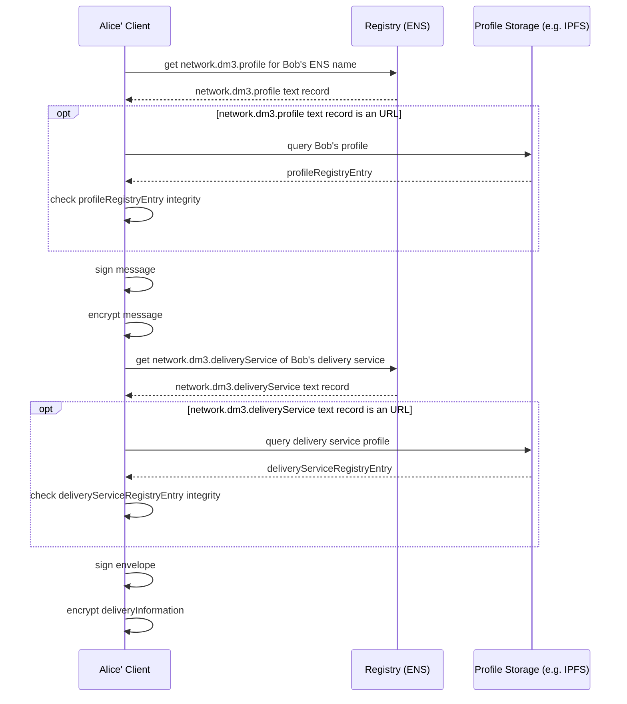
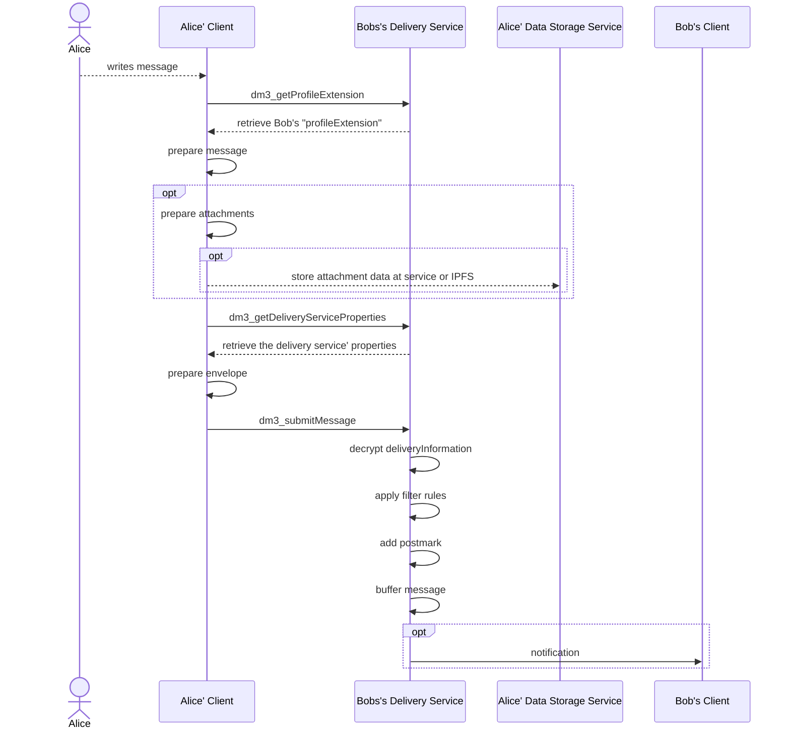

# Message Transport

Sending (and receiving) a message takes place in 3 steps, although only the first two steps are part of the **dm3 Message Transfer Protocol**.

1. The sender app **prepares and sends the message to the receiver's delivery service**. If the primary delivery service (first on the list) is not available, the next one from the list is contacted (and so on).
2. The **delivery service buffers and processes the message** (checks envelope, creates postmark to protocol time of delivery, optionally sends a notification to the receiver, ...).
3. _The **message is picked up by the recipient**. As soon as the recipient reports the successful processing of the message to the delivery service, the latter deletes the buffered message.
**!!!** This is not part of the "Message Transfer Protocol", as this depends on the implementation and objective of the delivery service. If the delivery service is following the **dm3 Access Specification** to serve **dm3** compatible clients, it offers a REST API to retrieve the messages, but a delivery service may also act as an interface/gateway to another protocol or application ecosystem, handling incoming messages according to its rules. **!!!**_


## Workflow

### Step 1: Preparation of the Message and Envelope

**Get dm3 profile**

1. Read the `network.dm3.profile` text record of the receiver's ENS name.
If the profile record is not set, the message cannot be delivered. It has to stay with the sender until the potential receiver publishes his/her profile.
2. The content is specified as URI (Uniform Resource Identifier). The following types must be supported:
   1. **DATA:** The content is delivered as JSON. The data scheme MUST be `application/json`. Optionally, the JSON content is **base64** encoded. This must be specified as scheme extension `application/json;base64`. If not base64 encoded, the content might be URL-encoded.
   > _**Example:**_
   > `data:application/json,%7B%22profileRegistryEntry%22%3A...`
   > `data:application/json;base64,eyJwdWJsaWNFbmNyeX...`
   2. **HTTPS:** The content is retrieved as a JSON object from a server and the `dm3Hash` URL parameter is used to check the integrity of the profile string.
   > _**Example:**_
   > `https://exampleserver/example?dm3Hash=0x12ab4...`
   3. **IPFS:** The content is retrieved as a JSON object using IPFS network.
   > _**Example:**_
   > `ipfs://QmU6n6n1Q...`

3. Interprete JSON object as **dm3 profile**.
4. Select the receiver's delivery service ENS name by reading the `deliveryServices` user profile entry at index `0`.
   1. Get the `network.dm3.deliveryService` text record of the delivery service's ENS name. The content is delivered as URI (data, HTTPS, or IPFS), as described above in point 2.
   2. Interprete JSON object as **dm3 delivery service profile**.
5. If the selected delivery service is unavailable, the sender MUST use the delivery service with the next higher index in the `deliveryServices` list as a fallback.

**Create a Message and Envelope**

1. Get ProfileExtension from delivery service
    * Read optional encryption parameters (like preferred encryption algorithm deviating from standard)
    * Read supported message types. Only supported messages must be sent.
2. Sign the message using the private sender signing key, using ECDSA.
3. Encrypt the message using the public encryption key of the receiver (part of the user profile). The default encryption algorithm is **x25519-chacha20-poly1305**. If a different algorithm is required (defined in the _ProfileExtension_), this should be used for encryption. If it is not supported by the sender, the default encryption is used.
4. Encrypt the delivery information using the public encryption key of the delivery service (part of the delivery service profile). The mandatory encryption algorithm is **x25519-chacha20-poly1305**.



**Submit Message**

1. Get ProfileExtension from delivery service
    * Read spam protection settings (see [Profile Extension](mtp-deliveryservice-api.md#get-the-users-profile-extension)).
    * Check, if conditions are met. If not, the message must not be sent (as it will be discarded from the receiving delivery service anyway). The sender should be informed.
2. Submit the message to the delivery service using the URL defined in the delivery service profile.

### Step 2: Message processing at the delivery service

1. Decrypt delivery information.
2. Apply filter rules from the receiver's profile extension. Discard the message if conditions are not met.
3. Create a postmark. The postmark protocols the reception and buffering of the message.
4. Buffer message. The delivery service is responsible to store the encrypted message until the receiver picks it up. A delivery service may decide to have a max holding time. It must be at least 1 month. If the receiver didn't fetch the message within this time, the message may be deleted. This time can be queried from the [delivery service' properties](mtp-deliveryservice-api.md#get-properties-of-the-delivery-service)
5. Optional: send notification(s) to the receiver that a message is waiting for delivery.



## Message Data Structure

The message data structure stores all data belonging to the message that can only be read by the receiver. The entire data structure is encrypted (based on the public key of the receiver).

The message data structure contains the following information:

* **Message:** _(OPTIONAL)_ This string contains the actual message. For service messages (like READ_RECEIPT, RESEND_REQUEST, or DELETE_REQUEST), this field may be empty or undefined. The message MUST be **plain text** (UTF-8), optionally flavored with **Markdown** highlightings.
If other encodings of the message are provided, those MUST be attached as attachment (embedded with data scheme only), still providing the text representation in the message string. Clients able to interpret the encoded attachment may display this instead of the original message string. Others will visualize the message text as plain text or Markdown formatting.
* **Metadata:** This object contains all meta information about the message. Some attributes are mandatory, others are optional. Also, application-specific attributes can be added. The [MessageMetadata-Structure](#message-meta-data-structure) is described in detail below.
* **Attachments:** _(OPTIONAL)_ Media or other files or special encodings of the message may be an attachment to a message, defined as an array of URIs (data, HTTPS, IPFS). [Attachments](#attachments) are described in detail below.
* **Signature:** This is the signature with the sender's signature key on the SHA-256 hash of the message data structure without the signature field.

**DEFINITION:** Message Data Structure

```JavaScript
{
   // message text
   // optional (not needed for messages of type READ_RECEIPT, DELETE_REQUEST, and RESEND_REQUEST)
   message?: string,
   // metadata added to the message.
   metadata: MessageMetadata,
   // message attachments e.g. images as an array of URIs
   // (optional)
   attachments?: string[],
   //the signature of the sender
   // sign( sha256( safe-stable-stringify( struct_without_sig ) ) )
   signature: string
}
```

## Message Metadata Structure

The **message metadata structure** stores all meta information belonging to a message. While some attributes are mandatory, others are optional. If needed, application-specific meta information may be added, too.

The **message metadata structure** contains the following information:

* **To:** The ENS name the message is sent to.
* **From:** The ENS name of the sender
* **Timestamp:** The timestamp (unixtime in milliseconds) when the message was created.
* **Type:** Different types of messages can be sent. A **dm3** compatible messenger may not support all types in the UI but must at least handle not interpreted types meaningful (_example: the messenger doesn't support editing existing messages. It appends messages with the type **EDIT** as new messages at the bottom of the conversation_).
  * **NEW:** A new message.
  * **DELETE_REQUEST:** _(OPTIONAL)_ This is a service message. The sender wants the referenced message deleted. The value **referenceMessageHash** points to the message to be deleted. If the receiver's messenger doesn't support the deletion of messages, it may ignore the message.
  * **EDIT:** _(OPTIONAL)_ An already existing (old) message was edited (new version). The value **referenceMessageHash** points to the message to be replaced with a new version. If edit is not supported by the receiver's messenger, the message must be added as new.
  * **REPLY:** _(OPTIONAL)_ This message is a direct reply to an existing message. The value **referenceMessageHash** points to the referenced message. If threads/references are not supported, it must be added as a new message.
  * **REACTION:** _(OPTIONAL)_ This is a short referenced message, containing an emoji as a **message**, and the value **referenceMessageHash** points to the referenced message.
  * **READ_RECEIPT:** _(OPTIONAL)_ This is a service message. The receiver sends this message back to the sender to signal that the message was received and displayed. Sending this message is optional and it may be ignored.
  * **RESEND_REQUEST:** _(OPTIONAL)_ This is a service message. The value **referenceMessageHash** points to the referenced message. If possible (=available), the referenced message should be sent again.
* **Reference Message Hash:** _(OPTIONAL)_ The hash of a previous message that the new one references. Must be set for message types (REPLY, DELETE_REQUEST, EDIT, REACTION, RESEND_REQUEST).
* **Reply Delivery Instruction:** _(OPTIONAL)_ It is needed for compatibility reasons with other protocols/apps. The stored information MUST be delivered with any reply (e.g., a conversation or topic id, ...) as meta information of the [encryption envelope](#encryption-envelope-data-structure). It is neither evaluated nor altered from **dm3**.

**DEFINITION:** Message Metadata Structure

```JavaScript
{
   // receiver ens-name
   to: string,
   // sender ens-name
   from: string,
   // message creation timestamp
   timestamp: number,
   // specifies the message type
   type: "NEW" | "DELETE_REQUEST" | "EDIT" | "REPLY" | "REACTION" | "READ_RECEIPT" | "RESEND_REQUEST"
   // message hash of the reference message
   // optional (not needed for messages of type NEW)
   referenceMessageHash?: string,
   // instructions used by the receiver of the message on how to send a reply
   // optional (e.g., used for bridging messages to other protocols)
   replyDeliveryInstruction?: string,
   // any kind of additional metadata may be added. 
   // This might be information needed by protocol extensions or app-specific meta information.
   ...
}
```

## Attachments

Attachments can be any type of additional data or media files. These are organized as an array of URIs. Embedded content is encoded as data scheme, external data as URL or IPFS. A message can have no or an arbitrary number of attachments.
The overall size of the message (inclusive of all embedded attachments) MUST be less than 20MB. The overall size of the message can be restricted additionally by the delivery service (see [Delivery Service Properties](mtp-deliveryservice-api.md#get-properties-of-the-delivery-service).)
If bigger media files need to be attached, the actual data need to be stored outside the message (still encrypted with the receiver's public key) and the attachment contains only the reference (URI with HTTPS or IPFS scheme). Otherwise, the attachment may be included with URI scheme data.

Different **dm3** compatible applications may handle attachments differently (visualization, embedding, or even ignoring them).
Applications may optionally support other encodings than text/markdown for the message. These may be added as attachment and visualized instead of the original message text. It is the application's responsibility to do this properly.

 _**Examples:**_
>
> ```JavaScript
> "attachments":["data:text/html;base64,dfEwwewGJsaWKklNyeX...",...],
> ```

> ```JavaScript
> "attachments":["data:image/jpeg;base64,dfEwwewGJsaWKklNyeX...",...],
> ```

> ```JavaScript
> "attachments":["https://exampleservice/exampleresource",...],
> ```

> ```JavaScript
> "attachments":["ipfs://AmE6mn1n64Q...",...],
> ```

## Encryption Envelope Data Structure

The encryption envelope is the data structure that is sent to the delivery service. It contains delivery metadata and the encrypted message itself. The envelope is read and interpreted by the delivery service. However, the actual message is encrypted based on the receiver's key and signed with the sender's key so that it cannot be read or altered by the delivery service.

The encryption envelope contains the following data:

* **Message:** The encrypted message ([Message Data Structure](#message-data-structure)).
* **Metadata:** This object contains all meta information about the envelope. Some attributes are mandatory, others are optional. Also, application-specific attributes can be added. The [EnvelopeMetadata Structure](#envelope-metadata-structure) is described in detail below.
* **Postmark:** _(OPTIONAL)_ A data struct with the information on the delivery status. Postmark is empty/undefined when the sender is sending the envelope to the delivery service. It is added by the delivery service and is encrypted based on the public key of the receiver.

**DEFINITION:** Encryption Envelope Structure

```JavaScript
{
  // the message 
  // encrypted based on the receiver's public encryption key
  message: string,
  // meta information for the envelope
  metadata: EnvelopeMetadata,
  // contains information added by the delivery service
  // encrypted based on receiver's public encryption key
  postmark?: string,
}
```

## Envelope Metadata Structure

The **envelope metadata structure** stores all meta information belonging to an envelope. While some attributes are mandatory, others are optional. If needed, application-specific meta information may be added, too.

The **envelope metadata structure** contains the following data:

* **Version:** The protocol version of **dm3**.
* **Encryption Scheme:** The used encryption and signing algorithms. The default is **x25519-chacha20-poly1305**. If this field is not set (undefined), the default is being used.
* **Delivery Information:** A data struct with the delivery information needed by the delivery service (message metadata).

**DEFINITION:** Envelope Metadata Structure

```JavaScript
{
  // dm3 protocol version (e.g., 1.0)
  version: string,
  // used encryption scheme of the message
  //optional: if not set, the default x25519-chacha20-poly1305 is taken
  encryptionScheme?: string,
  // datastruct with delivery info
  // Delivery information object, encrypted based on the delivery servics' encryption key
  deliveryInformation: string,
  // any kind of additional metadata may be added. 
  // This might be information needed by protocol extensions or app-specific meta information.
  ...
  // the signature of the sender
  // sign( sha256( safe-stable-stringify( struct_without_sig ) ) )
  signature: string,
}
```

## Delivery Information

The delivery information contains all metadata needed by the delivery service to handle a message.

The data structure contains the following information:

* **To:** The ENS name the message is sent to.
* **From:** the ENS name of the sender
* **Delivery Instruction:** this is optional information. It is needed for compatibility reasons with other protocols/apps. The stored information (e.g., a conversation or topic id, ...) will be delivered with any reply from the receiver. It is neither evaluated nor altered from **dm3**.

**DEFINITION:** Delivery Information

```JavaScript
{
  // receiver ens-name
  to: string,
  // sender ens-name
  from: string,
  // instructions used by the delivery service on how to deliver the message
  // optional (used for bridging messages to other protocols)
  deliveryInstruction?: string
}
```

## Postmark Data Structure

The postmark data structure contains information added by the delivery service regarding the delivery status.

It contains the following information:

* **Massage Hash:** the Hash (SHA-256) of the entire message.
* **Incoming Timestamp:** The unixtime in milliseconds when the delivery service received the message.
* **Delivery Information:** This is a copy of the delivery information provided in the envelope. As this info in the envelope is encrypted for the delivery service, it MUST be added from the delivery service to the postmark. The receiver can use this information to check if the sender of the message referenced in the [Message Metadata](#message-metadata-structure)) is the same as referenced in the envelope.
* **Signature:** the signature of the postmark from the delivery service. This is needed to validate the postmark information.

**DEFINITION:** Postmark

```JavaScript
{
  // sha256( EncryptionEnvelope.message ) 
  messageHash: string,
  // timestamp of when the delivery service received the message
  incomingTimestamp: number,
  // a copy of the delivery information from the envelope the delivery service
  deliveryInformation: DeliveryInformation,
  // signature of the delivery service
  // sign( sha256( safe-stable-stringify( postmark_without_sig ) ) )
  signature: string,
}
```
