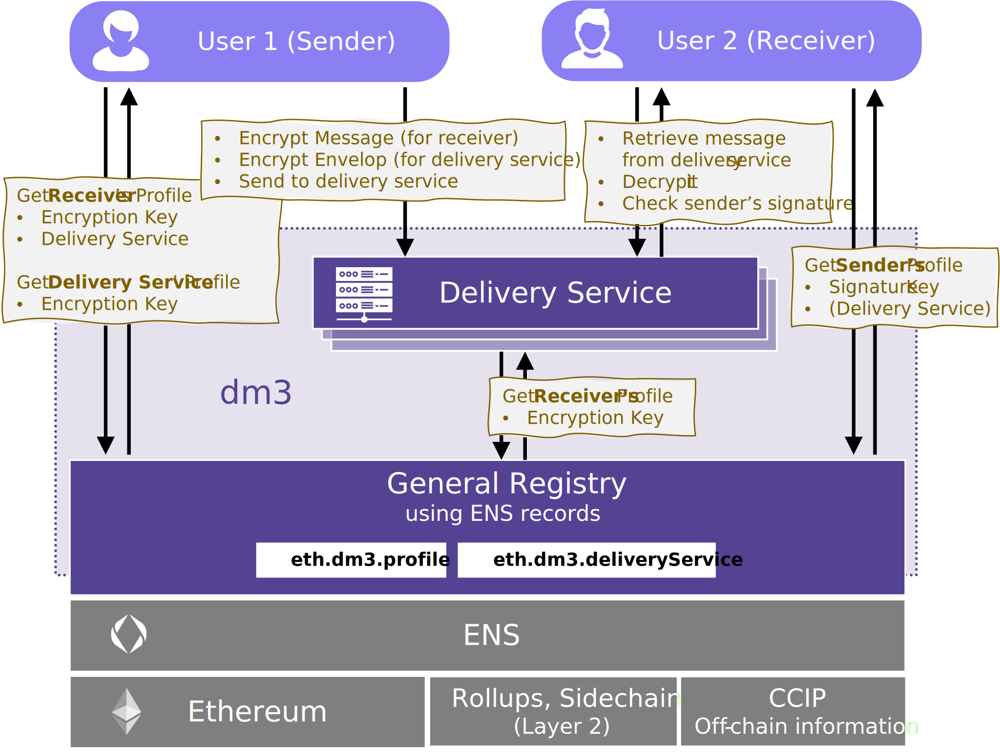

# Message Transport

Sending (and receiving) a message takes place in 3 steps, although only the first two steps are part of the **dm3 Message Transfer Protocol**.

1. The sender app **prepares and sends the message to the receiver's delivery service**. If the primary delivery service (first in the list) is not available, the next one from the list is contacted (and so on).
2. The **delivery service buffers and processes the message** (checks envelop, creates postmark to protocol time of delivery, optionally sends notification to receiver, ...).
3. _The **message is picked up by the recipient**. As soon as the recipient reports the successful processing of the message to the delivery service, the latter deletes the buffered message.
**!!!** This is not part of the "Message Transfer Protocol", as this depends on the implementation and objective of the delivery service. If the delivery service is following the **dm3 Access Specification** to serve **dm3** compatible clients, it offers a REST API to retrieve the messages, but a delivery service may also act as interface to another protocol or application ecosystem, handling incoming messages according to its rules. **!!!**_



## Workflow

### Step 1: Preparation of the Message and Envelope

**Get dm3 profile**

1. Read the `eth.dm3.profile` text record of the receiver's ENS name.
If the profile record is not set, the message cannot be delivered. It has to stay with the sender until the potential receiver publishes his/her profile.
2. If the content of the text record is a URL (IPFS or service), read the file's content.
   * IPFS: retrieve JSON object using IPFS network.
   * Service: retrieve JSON object from server and use the `dm3Hash` URL parameter to check the integrity of the profile string.
3. Interprete JSON object as **dm3 profile**.
4. Select the receiver's delivery service ENS name by reading the `deliverySerives` user profile entry at index `0`.
   1. Get the `eth.dm3.deliveryService` text record of the delivery service's ENS name.
   2. If the content of the text record is an URL (IPFS or service), read the file's content (as described above in point 2).
   3. Interprete JSON object as **dm3 delivery service profile**.
5. If the selected delivery service is unavailable, the sender MUST use the delivery service with the next higher index in the `deliveryServices` list as fallback.

**Create Message and Envelope**

1. Get mutableProfileExtensionUrl from **dm3 profile**
_if available:_
    * read optional encryption parameters (see also Encryption)
2. Sign the message using the private sender signing key, using ECDSA.
3. Encrypt the message using the public encryption key of the receiver (part of the user profile). Default encryption algorithm is **x25519-chacha20-poly1305**. If a different algorithm is required (defined in the _mutableProfileExtension_), this should be used for encryption. If it is not supported by the sender, the default encryption is used.
4. Encrypt the delivery information using the public encryption key of the delivery service (part of the delivery service profile). The mandatory encryption algorithm is **x25519-chacha20-poly1305**.

```{mermaid}
  sequenceDiagram
    participant AA as Alice' Client
    participant E as ENS
    participant P as Profile Storage (e.g. IPFS)
    AA->>E: get eth.dm3.profile for Bob's ENS name
    E-->>AA: eth.dm3.profile text record
    opt eth.dm3.profile text record is an URL
      AA->>P: query Bob's profile
      P-->>AA: profileRegistryEntry
      AA->>AA: check profileRegistryEntry integrity
    end
    AA->>E: get eth.dm3.deliveryService of Bob's delivery service
    E-->>AA: eth.dm3.deliveryService text record
    opt eth.dm3.profile text record is an URL
      AA->>P: query delivery service profile 
      P-->>AA: deliveryServiceRegistryEntry
      AA->>AA: check deliveryServiceRegistryEntry integrity
    end
    AA->>AA: sign message
    AA->>AA: encrypt message
    AA->>AA: encrypt deliveryInformation
```

**Submit Message**

1. Get mutableProfileExtensionUrl from **dm3 profile**
_if available:_
    * Read spam protection settings (see Mutable Profile Extension).
    * Check, if conditions are met. If not, message must not be sent (as it will be discarded from the receiving delivery service anyway). The sender should be informed.
2. Submit the message to the delivery service using the URL defined in the delivery service profile.

### Step 2: Message processing at the delivery service

1. Decrypt delivery information.
2. Apply filter rules from the receiver's mutable profile extension. Discard the message if conditions are not met.
3. Create a postmark. The postmark protocols the reception and buffering of the message.
4. Buffer message. The delivery service is responsible to store the encrypted message until the receiver picks it up. A delivery service may decide to have a max holding time. It must be at least 1 month. If the receiver didn't fetch the message within this time, the message may be deleted.
5. Optional: send notification(s) to the receiver that a message is waiting for delivery.

```{mermaid}
  sequenceDiagram
    actor A as Alice
    participant AA as Alice' Client
    participant BD as Bobs's Delivery Service
    participant BB as Bob's Client   
    A->>AA: writes message
    AA->>AA: prepare message
    AA->>BD: dm3_submitMessage
    BD->>BD: decrypt deliveryInformation
    BD->>BD: apply filter rules
    BD->>BD: add postmark
    BD->>BD: buffer message
    opt
       BD->>BB: notification
    end  
```

## Message Data Structure

The message data structure stores all data belonging to the message that can only be read by the receiver. The entire data structure is encrypted with the public key of the receiver.

The message datastructure contains the following information:

* **To:** The ENS name the message is sent to.
* **From:** The ENS name of the sender
* **Timestamp:** The timestamp (unixtime) when the message was created.
* **Message:** This string contains the actual message. For service messages (like READ_RECEIPT or DELETE_REQUEST), this field may be empty.
* **Type:** Different types of messages can be sent. A **dm3** compatible messenger may not support all types in the UI but must at least handle not interpreted types meaningful (_example: the messenger doesn't support editing existing messages. It appends messages with the type **EDIT** as new messages at the bottom of the conversation_).
  * **NEW:** A new message.
  * **DELETE_REQUEST:** _(OPTIONAL)_ This is a service message. The sender wants the referenced message deleted. The value **referenceMessageHash** points to the message to be deleted. If receiver's messenger doesn't support deletion of messages, it may ignore the message.
  * **EDIT:** _(OPTIONAL)_ An already existing (old) message was edited (new version). The value **referenceMessageHash** points to the message to be replaced with a new version. If edit is not supported by the receiver's messenger, the message must be added as new.
  * **REPLY:** _(OPTIONAL)_ This message is a direct reply to an existing message. The value **referenceMessageHash** points to the referenced message. If threads/references are not supported, it must be added as new message.
  * **REACTION:** _(OPTIONAL)_ This is a short referenced message, containing an emoji as **message** and the value **referenceMessageHash** points to the referenced message.
  * **READ_RECEIPT:** _(OPTIONAL)_ This is a service message. The receiver sends this message back to the sender to signal that the message was received and displayed. Sending this message is optional and it may be ignored.
  * **RESEND_REQUEST:** _(OPTIONAL)_ This is a service message. The value **referenceMessageHash** points to the referenced message. If possible (=available), the referenced message should be sent again.
* **Reference Message Hash:** The hash of a previous message that the new one references. Must be set for message types (REPLY, DELETE_REQUEST, EDIT, REACTION, RESEND_REQUEST).
* **Attachments:** Media or other files may be an attachment to a message. Attachments are described in detail below.
* **Reply Delivery Instruction:** this is an optional information. It is needed for compatibility reasons with other protocols/apps. The stored information will be delivered with any reply (e.g., a conversation or topic id, ...). It is neighter evaluated nor altered from **dm3**.
* **Signature:** This is the signature with the sender's signature key on the SHA-256 hash of the message datastructure without the signature field.

**DEFINITION:** Message Data Structure

```JavaScript
{
   // receiver ens-name
   to: string,
   // sender ens-name
   from: string,
   // message creation timestamp
   timestamp: number,
   // message text
   // optional (not needed for messages of type READ_RECEIPT and DELETE_REQUEST)
   message: string,
   // specifies the message type
   type: "NEW" | "DELETE_REQUEST" | "EDIT" | "THREAD_POST" | "REACTION" | "READ_RECEIPT"
   // message hash of the reference message
   // optional (not needed for messages of type NEW)
   referenceMessageHash: string,
   // message attachments e.g. images
   // optional
   attachments: Attachment[],
   // instructions used by the receiver of the message on how to send a reply
   // optional (e.g., used for bridging messages to other protocols)
   replyDeliveryInstruction: string,
   // sign( sha256( safe-stable-stringify( message_without_sig ) ) )
   signature: string
}
```

## Attachments

Attachments can be any type of additional data or media files. These are organized in the attachment data structure. A message can have no, or an arbitrary number of attachments.
The overall size of the message (inclusive all attachments) must be less than 20MB. If bigger media files need to be attached, the actual data need to be stored outside the message (still encrypted with the receiver's public key) and the attachment contains only the reference (e.g., an IPFS link).
Attachments are optional. Different **dm3** compatible application may handle attachments differently (visualization, embedding, or even ignore it).

The attachment data structure contains:

* **Type:** the MIME type of the attachment.
* **Data:** the base64 encoded data of the media file.

**DEFINITION:** Attachment Data Structure

```JavaScript
{
  // MIME types
  type: string,
  // the data, base64 encoded
  data: string
}
```

## Encryption Envelop Data Structure

The encryption envelop is the data structure which is sent to the delivery service. It contains delivery metadata and the encrypted message itself. The envelop is read and interpreted by the delivery service. However, the actual message is encrypted with the receivers key and signed with the senders key so that it cannot be read or altered by the delivery service.

The encryption envelop contains the following data:

* **Version:** the protocol version of **dm3**.
* **Message:** the encrypted message (Message Data Structure).
* **Delivery Information:** a data struct with the delivery information needed by the delivery service (message meta data).
* **Postmark:** a data struct with the information of the delivery status. It is added by the delivery service and is encrypted with the public key of the receiver.

**DEFINITION:** Encryption Envelop

```JavaScript
{
  // dm3 protocol version
  version: '0.1'
  // if private message: encrypted with receiver public encryption key
  message: string; 
  // datastruct with delivery info
  deliveryInformation: DeliveryInformation
  // encrypted with receiver public encryption key
  postmark: Postmark
}
```

## Delivery Information

The delivery information contains all meta data needed by the delivery service to handle a message.

The data structure contains the following information:

* **To:** The ENS name the message is sent to.
* **From:** the ENS name of the sender
* **Delivery Instruction:** this is an optional information. It is needed for compatibility reasons with other protocols/apps. The stored information (e.g., a conversation or topic id, ...) will be delivered with any reply of the receiver. It is neighter evaluated nor altered from **dm3**.

**DEFINITION:** Delivery Information

```JavaScript
{
  // receiver ens-name
  to: string,
  // sender ens-name
  from: string,
  // instructions used by the delivery service on how to deliver the message
  // optional (used for bridging messages to other protocols)
  deliveryInstruction: string
}
```

## Postmark Data Structure

The postmark data structure contains information added by the delivery service regarding the delivery status.

It contains the following information:

* **Massage Hash:** the Hash (SHA-256) of the entire message.
* **Incomming Timestamp:** The unix time when the delivery service received the message.
* **Signature:** the signature of the postmark from the delivery service. This is needed to validate the postmark information.

**DEFINITION:** Postmark

```JavaScript
{
  // if unecrypted sha256( safe-stable-stringify( EncryptionEnvelop.message ) ) 
  // if encrypted sha256( EncryptionEnvelop.message ) 
  messageHash: string,
  // timestamp of when the delivery service received the message
  incommingTimestamp: number,
  // sign( sha256( safe-stable-stringify( postmark_without_sig ) ) )
  signature: string
}
```
