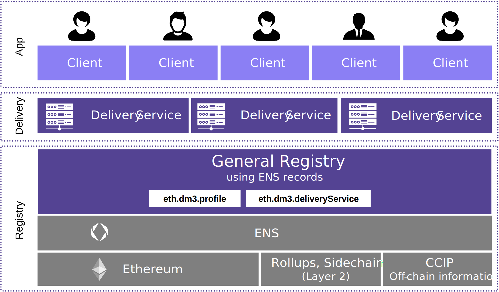
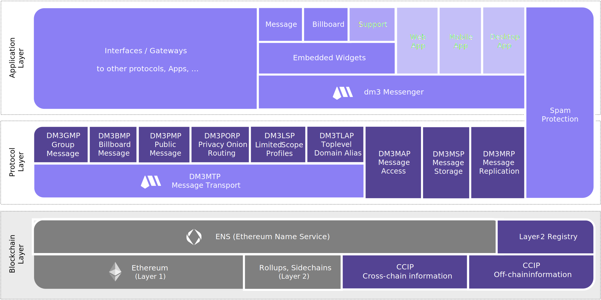

# Overview

## Abstract

_The **dm3** (**D**ecentralized **M**essaging for web**3** or **D**irect **M**essage **3**) protocol is an end-2-end **encrypted** peer-2-peer messaging protocol, rooted in **ENS** (Ethereum Name Service). It is **decentralized**, has no single-points-of-failure, has a **lean architecture** with minimum resource requirements, and enables **interoperability** with other messaging solutions while preserving the **self-sovereignty** of its users.
The **dm3** protocol uses **ENS** as central registry for necessary contact information (like public keys, addresses of delivery services, ...), stored in ENS text records, in combination with a standardized API to build an open ecosystem of message delivery services allowing to send messages from ENS name to ENS name._

## Motivation

Messaging (such as instant messages, chats, email, etc.) has become an integral part of most people's lives. Mobile devices (such as smartphones, tablets, laptops, etc.) with instant access to the Internet make it possible to be in touch with family, friends, as well as work colleagues, and customers at any time.

While email services are still largely decentralized and interoperable, the lack of appropriate spam protection methods other than blocking and censoring has resulted in only a few large providers interacting with each other, not to mention the fact that even today a large portion of email communication is mostly unencrypted.

Messaging services on the web2 (like WhatsApp, Signal, Telegram, ...) have become closed silos, making cross-service or cross-app communication almost impossible. Although they mostly offer end-to-end encryption, some services may still have backdoors via the central service providers or can stop end-2-end encryption without the user's approval.

In the past months, several different approaches and tools have been presented in web3. Methods from the web3 such as key-based identification, encryption, and the availability of blockchain-based registries are being used. Many applications are built to meet user preferences, and several protocols have been presented. Trade-offs are often necessary - such as centralized services, application-related registries, or complex protocols. Interoperability across applications, services, and protocols is still limited, if possible at all.

With **dm3**, a protocol is presented, which is characterized by a very lean base protocol (DM3MTP - the **dm3** message transfer protocol), which can serve as a bridge between different services and can enable integration and interoperability with other services and different applications. The aim of **dm3** is to suggest a common base standard for web3 messaging, on which further protocols and applications can be built to create a silo-free, secure, self-determined, decentralized messaging ecosystem - based on web3 technology.

**This allows users not only to have full control over their data and messages but also to choose the messaging app that best suits their needs and preferences, without the compromise of being limited to a particular ecosystem.**
  
## Base Architecture

The **dm3** protocol is designed as a lean peer-2-peer messaging protocol with consistent end-to-end encryption and sufficient decentralization through an open delivery service architecture.

Due to its simple base architecture, **dm3** is intended as a base protocol to bring together a variety of messaging applications and protocols so that true interoperability can be realized.

Required contact information such as public encryption keys and public keys to verify signatures as well as information on used delivery services are managed as text records in ENS (Ethereum Name Service) - the **dm3 profile**. This provides a general registry that can be accessed across applications and protocols. Thus, services using this standard do not have to rely on the technology and availability of one provider, nor does it result in the emergence of various incompatible silos in web3 as in web2.

## Protocol Extensions

While the specification of the **Message Transport Protocol (DM3MTP)** focuses on a standardized format description for general messages and how to deliver those messages to a delivery service defined in the receiver's **dm3** profile, several optional protocol extensions are defined to cover further topics.

The **dm3** delivery service and **dm3** compatible app implementations MAY also use the following **dm3** protocol extensions:

* **Message Access Specification**: Specifies how received messages on a delivery service can be accessed.
* **[Message Storage Specification](message-storage/msp.rst)**: Specifies how messages are persisted after they are delivered.
* **Public Message Feed Specification**: Specifies how a public message feed is created and accessed.
* **Intra Delivery Service Messaging Specification**: Specifies additional features for messaging if sender and receiver are using the same delivery service.
* **Group Messaging Specification**: Specifies a protocol extension to enable group messaging.
* **Encryption and Signing Key Derivation Specification**: Specifies how to derive keys from the wallet key.
* **Privacy Onion Routing Specification**: Specifies a protocol extension to enable privacy-preserving onion routing.
* **Spam Protection Specification**: Specifies additional methods, based on web3 technology, that prevent spam on the receiver's side.
* **Layer-2 Registry Specification**: Specifies how to include a layer-2 or cross-chain registry into subdomains to extend the general registry
* **Top-Level Alias Specification**: Specifies how subdomains can be mapped to non-ENS-top-level domains. This is needed for instance for cross-chain interoperability.

_The specifications for the protocol extensions are still in draft status and will be published soon._
