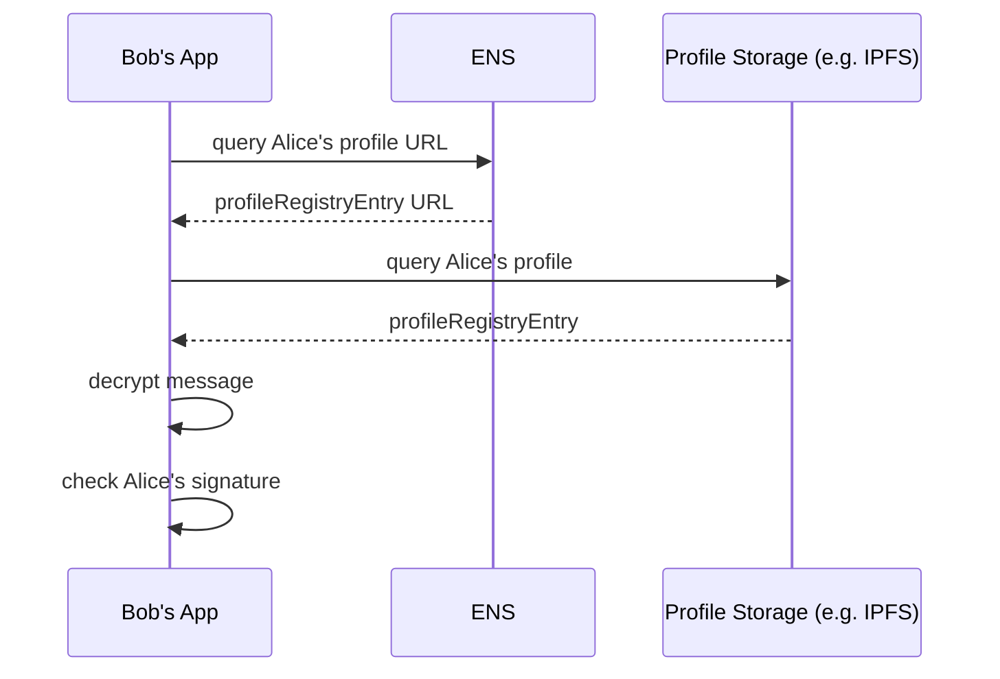

## Abstract
The specified protocol uses ENS text records in combination with a standardized API to build a federated system of message delivery services allowing to send messages from ENS name to ENS name.

## Motivation
// TODO


## Specification
This specification focuses on delivering messages between two parties with ENS names. There are also the following dm3 protocol extensions available:

* [Storage Specification]()
* [Public Message Feed Specification]()
* [Intra Delivery Service Messaging Specification]()
* [Group Messaging Specification]()


### Profile Registry
The protocol requires a registry where the dm3 app can look up dm3 profiles of other users and delivery services. dm3 uses the following ENS text records for this purpose:
* `eth.dm3.profile`: User profile entry
* `eth.dm3.deliveryService`: Delivery service profile entry 

Both text records contain URLs pointing to a JSON file containing the actual profile. It is essential to verify the integrity of the profile JSON files. A native IPFS URL or an URL containing exactly one `dm3Hash` parameter MUST be used. 

Example `eth.dm3.profile` text record entries:
* `https://delivery.dm3.network/profile/0xbcd6de065fd7e889e3...7553ab3cc?dm3Hash=0x84f89a7...278ca03e421ab50c8`
* `ipfs://bafybeiemxf5abjwjz3e...vfyavhwq/`


The profiles can only be changed by creating a new profile JSON file and changing the corresponding text record via an Ethereum transaction. It is possible to add a mutable profile extension for a user profile.

The user profile MUST contain:
* Public Signing Key: Key used to verify a message signature. 
* Public Encryption Key: Key used to encrypt a message.
* Delivery Service List: List with at least one delivery service ENS name.

The user profile MAY contain:
* Mutable Profile Extension URL: URL pointing to a JSON file containing additional profile information (e.g., spam filter settings). It is possible to change these information without sending an Ethereum transaction.

The delivery service profile MUST contain:
* Public Signing Key: Key used to verify a postmark signature. 
* Public Encryption Key: Key used to encrypt the delivery instructions.
* Delivery Service URL: URL pointing to the delivery service instance.

The following data structures defined in Appendix 2 MUST be used for the profile files.


### Message Transport Protocol

Sending a message takes place in four steps:
1. The sender app prepares and sends the message to the target delivery service.
2. The delivery service buffers and processes the message and pushes it to the receiver app.
3. The receiver app verifies the sender and displaying the message.
4. The receiver app stores the message and notifies the delivery service that the message can be removed from the buffer.

Step 1 MUST consist of the following sub-steps:
1. Query the `eth.dm3.profile` text record of the receiver's ENS name.
2. Use the URL  in `eth.dm3.profile` to retrieve the user profile document.
3. Use the `dm3Hash` URL parameter to check the integrity of the profile document. (Not necessary if it is an IPFS URL)
4. Select the receiver delivery service ENS name by reading the `deliverySerives` user profile entry at index `0`.
5. Repeat sub-steps 1 to 3 with `eth.dm3.deliveryService` instead of `eth.dm3.profile` to get the delivery service profile. If the selected delivery service is unavailable, the sender app MUST use the service with the next higher index in the `deliveryServices` list.
6. Sign the message using the private sender signing key.
7. Encrypt the message using the public encryption key of the receiver (part of the user profile).
8. Sender app encrypts the delivery information using the public encryption key of the delivery service (part of the delivery service profile).
9. Submit the message to the delivery service using the URL defined in the delivery service profile.

Step 2 MUST consist of the following sub-steps:
1. Decrypt delivery information.
2. Apply filter rules from the receiver's mutable profile extension file.
3. Create a postmark.
4. Buffer message.
5. Push message to receiver app.

Step 3 MUST consist of the following sub-steps
1. Get the sender profile the same way as in step 1, sub-steps 1 to 3.
2. Decrypt the message using the private encryption key.
3. Check the message signature using the public signature key in the sender user profile.
4. Display the message

Step 4 MUST consist of the following sub-steps
1. Try to persist the message.
2. Notify the delivery service that the message could be removed from the buffer.

The API defined in Appendix 1 and the data structures defined in Appendix 2 must be used for message transport.


## Appendix 1: Messaging Delivery Service API
This section describes the JSON-RPC methods that MUST be used to communicate with the delivery service. 

### `dm3_authChallenge`
Request a authentication challenge string to create a authentication token. 
**Request**
```TypeScript
{
  ensName: string
}
```

**Response**
```TypeScript
{
  // string that is used to create the authentication token.  
  // Autentication token = hash ( sign( challenge ) )
  challenge: string
}
```

### `dm3_submitMessage`
Submit a new message to the target delivery service.

**Request**
```TypeScript
// see appendix 3 for EncryptioEnvelop data structure
EncryptionEnvelop
```

**Response**
```TypeScript
success: boolean
```

### `dm3_getMessages`
Get messages sent from `senderEnsName` to `receiverEnsName`.  

**Request**
```TypeScript
{
  authToken: string,
  receiverEnsName: string,
  senderEnsName: string,
  fromTimestamp: number,
  count: number
}
```

**Response**
```TypeScript
// see appendix 3 for EncryptioEnvelop data structure
EncryptionEnvelop[]
```

### `dm3_getMessageCount`
**Request**
```TypeScript
{
  authToken: string,
  receiverEnsName: string,
  senderEnsName: string,
}
```

**Response**
```TypeScript
{
  count: number,
  lowestTimestamp: number
}
```

### `dm3_storageSyncAck`
Notify the delivery service that all messages sent from `senderEnsName` to `receiverEnsName` until `postmarkTimestamp` are persisted. The Delivery service will delete all messages where `incommingTimestamp <= postmarkTimestamp`.

**Request**
```TypeScript
{
  authToken: string,
  receiverEnsName: string,
  senderEnsName: string,
  postmarkTimestamp: number
}
```

**Response**
```TypeScript
{
  count: number,
  lowestTimestamp: number
}
```

### Event `dm3_newMessage`
The delivery service will emit this event to subscribers if there is a new message for them.
```TypeScript
// see appendix 3 for EncryptioEnvelop data structure
EncryptionEnvelop
```

### Event `connection`

## Appendix 2: Profile Data Structures
UserProfile
```JavaScript
{
  // Key used to encrypt messages
  publicEncryptionKey: string,

  // Key used to sign messages
  publicSigningKey: string,
  
  // ENS name list of the delivery services e.g. delivery.dm3.eth
  deliveryServices: string[], 

  // URL pointing to the profile extension JSON file
  mutableProfileExtensionUrl: string,

}
```

DeliveryServiceProfile
```JavaScript
{
  // Key used to sign postmarks
  publicSigningKey: string,

  // Key used to encrypt delivery information
  publicEncryptionKey: string,

  // URL pointing to the delivery service instance
  url: string
}
```

## Appendix 3: Messaging Data Structures

Message
 ```JavaScript
{
  
  // receiver ens-name
  // optional (not needed for public messages)
  to: string,

  // sender ens-name
  from: string,

  // message creation timestamp
  timestamp: number,

  // message text
  // optional (not needed for messages of type READ_RECEIPT and DELETE_REQUEST)
  message: string,

  // specifies the message type
  type: "NEW" | "DELETE_REQUEST" | "EDIT" | "THREAD_POST" | "REACTION" | "READ_RECEIPT"

  // message hash of the reference message
  // optional (not needed for message of type NEW)
  referenceMessageHash: string,

  // message attachments e.g. images
  // optional
  attachments: Attachment[],

  // instructions used by the receiver of the message on how to send a reply
  // optional (used for briding messages to other protocols)
  replyDeliveryInstruction: string,

  // sign( JSON.stringify( message_without_sig ) )
  signature: string

}
```

DeliveryInformation
```JavaScript
{
  // receiver ens-name
  // optional (not needed for public messages)
  to: string,

  // sender ens-name
  from: string,

  // instructions used by the delivery service on how to deliver the message
  // optional (used for briding messages to other protocols)
  deliveryInstruction: string
  
}
```

Postmark
```JavaScript
{
  // hash of the message
  messageHash: string,

  // timestamp of when the delivery service received the message
  incommingTimestamp: number,

  // sign( JSON.stringify( postmark_without_sig ) )
  signature: string
}
```

EncryptionEnvelop
```JavaScript
{
  // dm3 protocol version
  version: 'v1'
  
  // encryption default: x25519-chacha20-poly1305
  // optional (not needed if public message)
  encryptionVersion: 'x25519-chacha20-poly1305';

  // message
  // if private message: encrypted with receiver public encryption key
  // if public message: unencrypted
  message: string | message; 


  deliveryInformation: DeliveryInformation
  
  // 
  // encrypted with receiver public encryption key
  postmark: Postmark
}
 ```

Attachment
```JavaScript
{
  type: string;
  data: string;
}
 ```

 ## Appendix 4: Example Sequences

 ### Authentication 
   ```mermaid
  sequenceDiagram
    actor B as Bob
    participant BA as Bob's App
    participant BD as Bobs's Delivery Service
    
      B->>BA: open
    opt No authToken
      BA->>BD: dm3_authChallenge
      BD-->>BA: challenge
      BA->>BA: create authToken
      Note over BA: authToken: hash( sign( challenge ) )
    end

    BA->>BD: connect
    BD->>BD: check authToken

```
 ### Message Delivery
  ```mermaid
  sequenceDiagram
    actor A as Alice
    participant AA as Alice's App

    
    participant BD as Bobs's Delivery Service
    participant BA as Bob's App
    actor B as Bob

    A->>AA: writes message
  
    AA->>AA: prepare message

    AA->>BD: dm3_submitMessage
    BD->>BD: decrypt deliveryInformation
    BD->>BD: apply filter rules
    BD->>BD: add postmark
    BD->>BD: buffer message
    BD->>BA: dm3_newMessage
 
    BA->>BA: handle incoming message
    
    BA->>B: show message
    BA->>BA: persist message
    BA->>BD: dm3_storageSyncAck
    BD->>BD: remove message from buffer

```

**Prepare Message**
   ```mermaid
  sequenceDiagram
   
    participant AA as Alice's App
    participant E as ENS
    participant P as Profile Storage (e.g. IPFS)
  
    AA->>E: query Bob's profile URL
    E-->>AA: profileRegistryEntry URL
    AA->>P: query Bob's profile
    P-->>AA: profileRegistryEntry
    AA->>AA: check profileRegistryEntry integrity

    AA->>E: query delivery service entry URL
    E-->>AA: deliveryServiceRegistryEntry URL
    AA->>P: query delivery service entry 
    P-->>AA: deliveryServiceRegistryEntry
    AA->>AA: check deliveryServiceRegistryEntry integrity

    AA->>AA: sign message
    AA->>AA: encrypt message
    AA->>AA: encrypt deliveryInformation
    
```

**Handle Incoming Message**

