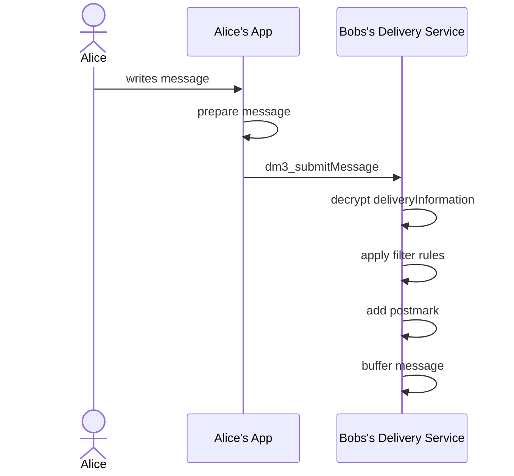
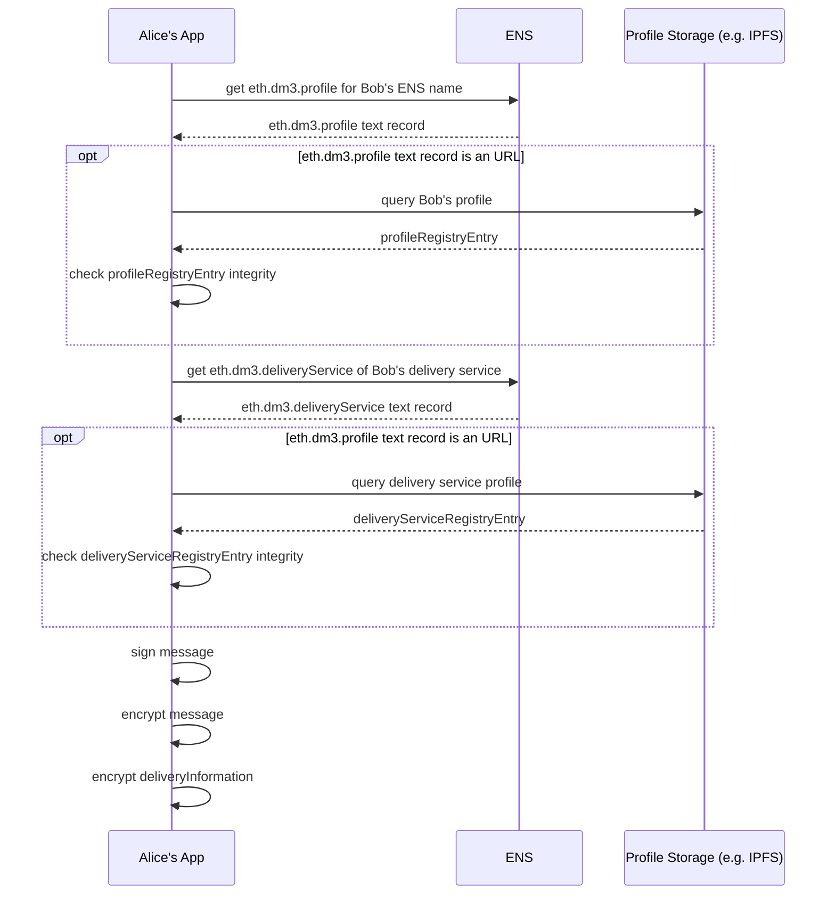

# Specification: _dm3_ Message Transport Protocol (DM3MTP)

## Abstract

_The **dm3** (for **D**ecentralices **M**essageing for web**3**) protocol is a peer-2-peer messaging protocol with with focus on seamless **end-2-end encryption** for messgages and connection meta data, **decentralization** and no single-points-of-failure, a **lean architecture** with minimum resource requirements, **interoperability** with other services and applications, and preserving the **self-sovereignity** of the users.
The dm3 protocol uses **ENS** (Etherem Name Service) as general registry for neccessary contact information (like public keys, addresses of delivery services, ...), stored in ENS text records, in combination with a standardized API to build an open system of message delivery services allowing to send messages from ENS name to ENS name._

## Motivation

Messaging (such as instant massages, chats, email, etc.) has become an integral part of most people's lives. Mobile devices (such as smartphones, tablets, laptops, etc.) with instant access to the Internet make it possible to be in touch with family, friends, as well as work colleagues and customers at any time.

While email is still largely decentralized and interoperable, the lack of appropriate spam protection methods other than blocking and censoring has resulted in only a few large providers interacting with each other, not to mention the fact that even today a large part of email communication is mostly unencrypted.
Messaging services on the web2 have become closed silos, making cross-service or cross-app communication almost impossible.

Although they mostly offer end-to-end encryption, some services may still have backdoors via the central service providers.

In the past months, a number of different approaches and tools have been presented in the web3. Methods from the web3 such as key-based identification, encryption, and the availability of blockchain-based registries are being used. Many applications are built to follow user preferences, several protocols, mostly application specific, have been presented. Trade-offs are often necessary - such as centralized services, complex protocols. Interoperability beyond applications, services, and protocols has been limited, if possible at all.

With dm3 a protocol is presented, which is characterized by a very lean basic protocol, which can serve as a bridge between different services and can enable integration and interoperability with other services and different applications.

## Base Architecture

The **dm3** protocol is designed as a lean peer-2-peer messaging protocol with consistent end-to-end encryption and sufficient decentralization through an open delivery service architecture.

Required contact information such as public keys for encryption and signatures as well as information on delivery services used are managed as text records in ENS (Ethereum Name Service). This provides a general registry that can be accessed across applications.

Due to its simple base architecture, **dm3** is intended as a base protocol to bring together a variety of messaging applications and protocols so that true interoperability can be realized. This allows users not only to have full control over their data and messages, but also to choose the messaging app that best suits their needs and preferences, without the compromise of being limited to a particular ecosystem.

## Specification

The specification of the **_dm3_ Message Transport Protocol** focuses on a standardized format description for general messages and how to deliver those messages to a delivery service defined in the receiver's **dm3** profile. The **dm3** delivery service and **dm3** compatible app implementations MAY also use the following **dm3** protocol extensions:

* [Message Access Specification](access-specification.md): Specifies how received messages on a delivery service can be accessed.
* [Message Storage Specification](storage-specification.md): Specifies how messages are persisted after they are delivered.
* [Public Message Feed Specification](feed-specification.md): Specifies how a public message feed is created and accessed.
* [Intra Delivery Service Messaging Specification](intra-deliveryservice-specification.md): Specifies additional features for messaging if sender and receiver are using the same delivery service.
* [Group Messaging Specification](group-messaging-specification.md): Specifies a protocol extension to enable group messaging.
* [Privacy Onion Routing Specification](privacy-specification.md): Specifies a protocol extension to enable privacy preserving onion routing.

### Profile Registry

A general registry is needed where a **dm3** compatible app can look up **dm3 profiles** of other users, containing

* public keys,
* links to delivery services, and
* additional information (like spam protection settings).

The **dm3** protocol uses **ENS** as general registry. The following text records are used for this purpose:

* `eth.dm3.profile`: User profile entry
* `eth.dm3.deliveryService`: Delivery service profile entry

The text records MUST either contain

* the profile JSON string defined in Appendix 1 or
* a URL pointing to a profile JSON string. To validate the integrity of the resolved profile JSON string, the URL MUST be a native IPFS URL or an URL containing a `dm3Hash` parameter containing the Keccak-256 hash of the JSON.

> **Example** `eth.dm3.profile` text record entries:
>
> * `https://delivery.dm3.network/profile/0xbcd6de065fd7e889e3...7553ab3cc?dm3Hash=0x84f89a7...278ca03e421ab50c8`
> * `ipfs://bafybeiemxf5abjwjz3e...vfyavhwq/`

The profiles can only be changed by creating a new profile JSON and changing the corresponding text record via an Ethereum transaction (if published on layer-1).

#### User Profile

The user profile MUST contain:

* **Public Signing Key:** Key used to verify a message signature (ECDSA).
* **Public Encryption Key:** Key used to encrypt a message. As default, the **x25519-chacha20-poly1305** is used. If needed (e.g., for compatibility reasons with an integrated protocol), a different encryption can be specified in the Mutable Profile Extension. Nevertheless, to use the default encryption is highly recommended.
* **Delivery Service List:** List with at least one delivery service ENS name.

The user profile MAY contain (optional):

* **Mutable Profile Extension URL:** a URL pointing to a JSON file containing additional profile information (e.g., spam filter settings, special encryption requirements). It is possible to change this information without sending an Ethereum transaction.

##### DEFINITION: UserProfile

```JavaScript
{
  // Key used to encrypt messages
  publicEncryptionKey: string,
  // Key used to sign messages
  publicSigningKey: string,
  // ENS name list of the delivery services e.g., delivery.dm3.eth
  deliveryServices: string[], 
  // URL pointing to the profile extension JSON file
  mutableProfileExtensionUrl: string,
}
```

> **Example** UserProfile with optional field _mutableProfileExtensionUrl_:
>
> ```JavaScript
> {
>    "publicEncryptionKey":"nyDsUmYV4EDNCsG+pK...D=",
>    "publicSigningKey":"MBpqhsSkxevwbYEGnXX9r...c=",
>    "deliveryService": ["<deliveryservice>.eth"],
>    "mutableProfileExtensionUrl":"https://<url_2_profile_extension>"
> }
> ```

> **Example** UserProfile with fallback delivery service:
>
> ```JavaScript
> {
>    "publicEncryptionKey":"nyDsUmYV4EDNCsG+pK...D=",
>    "publicSigningKey":"MBpqhsSkxevwbYEGnXX9r...c=",
>    "deliveryService": ["<deliveryservice>.eth","<fallback-deliveryservice>.eth"]
> }
> ```

The mutableProfileExtension (optional) conatains, if available, additional configuration information of the receiver:

* **Minimum Nonce:** the sender's address (address linked to the ENS domain) must have a nonce higher than this value, showing that this is a used account.
* **Minimum Balance:** the sender's address holds more than a defined minimum ether or an other token. This at least makes it more difficult/expensive for potential spammers to generate many new addresses from which to send messages, since these addresses then have to hold assets in order to be accepted as senders.
* **Encryption algorithm:** the default encryption algorithm is **x25519-chacha20-poly1305**. If another encryption algorithm needs to be used (e.g., because this is needed for an ecosystem which is integrated into **dm3**), this can be requested. The default algorithm should be accepted, too. Otherwise it might be impossible for a sender to deliver a message when it doesn't support the requested algorithm.

##### DEFINITION: mutableProfileExtension

```JavaScript
{
  // the minimum nonce of the sender's address, 
  // spam protection to prevent unused accounts 
  // to send messages
  // (optional)
  minNonce: string,
  // the minimum balcance of the senders address, 
  // spam protection to prevent unfunded addresses 
  // to send messages
  // (optional)
  minBalance: string,
  // token address, which shoould be evaluated. 
  // Empty address means Ether balance.
  // (optional)
  minBalanceTokenAddress: string,
  // Request of a specific ancryption algorithm.
  // This can be a list, sorted by importance
  // (optional)
  encryptionAlgorithm: string[],
}
```

> **Example** Mutable Profile Exception:
>
> ```JavaScript
> {
>    "minNonce":"1",
>    "minBalance":"1000000000000000000",
>    "encryptionAlgorithm": ["x25519-chacha20-poly1305"]
> }
> ```

#### Delivery Service Profile

The delivery service profile MUST contain:

* **Public Signing Key:** Key used to verify a postmark signature (ECDSA).
* **Public Encryption Key:** Key used to encrypt the delivery instructions (x25519-chacha20-poly1305).
* **Delivery Service URL:** URL pointing to the delivery service instance.

As encryption algorithm for the delivery service, the default algorithm **x25519-chacha20-poly1305** is mandadory.

##### DEFINITION: DeliveryServiceProfile

```JavaScript
{
  // Key used to sign postmarks
  publicSigningKey: string,
  // Key used to encrypt delivery information
  publicEncryptionKey: string,
  // URL pointing to the delivery service instance
  url: string
}
```

> **Example:** DeliveryServiceProfile
>
> ```JavaScript
> {
>    "publicEncryptionKey":"nyDsUmYV4EDNCsG+pK...D=",
>    "publicSigningKey":"MBpqhsSkxevwbYEGnXX9r...c=",
>    "url": "url_of_the_deliveryservice"
> }
> ```

### Message Transport Protocol

Sending (and receiving) a message takes place in 3 steps, although only the first two steps are part of the **dm3 Message Transfer Protocol**:

1. The sender app **prepares and sends the message to the receiver's delivery service**. If the primary delivery service (first in the list) is not available, the next one from the list is contacted (and so on).
2. The **delivery service buffers and processes the message**(checks envelop, creates postmark to protocol time of delivery, optionally sends notification to receiver, ...).
3. _The **message is picked up by the recipient**. As soon as the recipient reports the successful processing of the message to the delivery service, the latter deletes the buffered message.
**!!!** This is not part of the "Message Transfer Protocol", as this depends on the implementation and objective of the delivery service. Is the delivery service is following the **dm3 Access Specification** to serve **dm3** compatible clients, it offers a REST API to retrieve the messages, but a delivery service may also act as interface to another protocol or application ecosystem, handling incoming messages according to its rules. **!!!**_

``PIC: ### FLOW``

#### Step 1: Preparation of the Message and Envelope

##### Get dm3 profile

1. Read the `eth.dm3.profile` text record of the receiver's ENS name.
2. If the content of the text record is a URL (IPFS or to a service), read the file's content.
   * IPFS: retrieve JSON object using IPFS network.
   * Service: retrieve JSON object from server and use the `dm3Hash` URL parameter to check the integrity of the profile object.
3. Interprete JSON object as **dm3 profile**.
4. Select the receiver's delivery service ENS name by reading the `deliverySerives` user profile entry at index `0`.
   1. Get the `eth.dm3.deliveryService` text record of the delivery service's ENS name.
   2. If the content of the text record is an URL (IPFS or to a service), read the file's content (as described above in point 2).
   3. Interprete JSON object as **dm3 delivery service profile**.
5. If the selected delivery service is unavailable, the sender MUST use the delivery service with the next higher index in the `deliveryServices` list as fallback.

##### Create Message and Envelope

1. Get mutableProfileExtensionUrl from **dm3 profile**
_if available:_
    * read optional encryption parameters (see also Encryption)
1. Sign the message using the private sender signing key, using ECDSA.
2. Encrypt the message using the public encryption key of the receiver (part of the user profile). Default encryption algorithm is **x25519-chacha20-poly1305**. If a different algorithm is required (defined in the _mutableProfileExtension_), this must be used for encryption.
_**ATTENTION:** A deviation from the default may result in the message not being sent to the receiver, because the sender cannot handle the required encryption._
3. Encrypt the delivery information using the public encryption key of the delivery service (part of the delivery service profile). The mandadory encryption algorithm is **x25519-chacha20-poly1305**.

##### Submit Message

1. Get mutableProfileExtensionUrl from **dm3 profile**
_if available:_
    * Read spam protection settings (see Mutable Profile Extension).
    * Check, if conditions are met. If not, message must not be sent (as it will be discarded from the receiving delivery service). The user should be informed.
1. Submit the message to the delivery service using the URL defined in the delivery service profile.

#### Step 2: Message processing at the delivery service

1. Decrypt delivery information.
2. Apply filter rules from the receiver's mutable profile extension file. Discard the message if conditions are not met.
3. Create a postmark. TThe postmark protocols the reception and buffering of the message.
4. Buffer message. The delivery service is responsible to store the encrypted message until the receiver picks it up. A delivery service may decide to have a max holding time. If the receiver didn't fetch the message within this time, the message may be deleted.
5. Optional: send notification(s) to the receiver that a message is waiting for delivery.

#### Message Data Structure

The message data structure stores all data belonging to the message that can only be read by the receiver. The entire data structure is encrypted with the public key of the receiver.

The message datastructure contains the following information:

* **To:** The ENS name the message is sent to. In case of a public message, this is not needed.
* **From:** the ENS name of the sender
* **Timestamp:** the timestamp (unixtime) when the message was created.
* **Message:** this string contains the actual message. For service messages (like READ_RECEIPT or DELETE_REQUEST), this field may be empty.
* **Type:** Different types of messages can be sent. A **dm3** compatible messenger may not support all types, but must at least handle not interpreted types meaningful (_example: the messenger doesn't support editing existing messages. It appends messages with the type **EDIT** as new messages at the bottom of the conversation).
  * **NEW:** a new message
  * **DELETE_REQUEST:** This is a service message. The sender wants this message deleted. The value **referenceMessageHash** points to the message to be deleted. If receiver's messenger doesn't support deletion of messages, it may ignore the message.
  * **EDIT:** An already existing (old) message was edited (new version). The value **referenceMessageHash** points to the message to be replaced with a new version. If edit is not supported by the receiver's messenger, the message may be added as new.
  * **THREAD_POST:** This message is a direct reply to an existing message. The value **referenceMessageHash** points to the referenced message. If threads/references are not supported, it may be added as new message.
  * **REACTION:** This is a short referenced message, containing an emoji as **message** and the value **referenceMessageHash** points to the referenced message.
  * **READ_RECEIPT:** This is a service message. The receiver sends this message back to the sender to signal that the message was received and displayed. Sending this message is optional and it may be ignored.
* **Reference Message Hash:** Some message types (threads, delete, edit, reaction) need a references message.
* **Attachments:** Media files may be an attachment to a message. Attachments a described in detail below.
* **Reply Delivery Instruction:** this is an optional information. It is needed for compatibility reasons with other protocols/apps. The stored information will be delivered with any reply (e.g., a conversation or topic id, ...). It is neighter evaluated nor altered from **dm3**.
* **Signature:** Signature of the sender of the message datastructure.

##### DEFINITION Message Data Structure

```JavaScript
{
   // receiver ens-name
   // optional (not needed for public messages)
   to: string,
   // sender ens-name
   from: string,
   // message creation timestamp
   timestamp: number,
   // message text
   // optional (not needed for messages of type READ_RECEIPT and DELETE_REQUEST)
   message: string,
   // specifies the message type
   type: "NEW" | "DELETE_REQUEST" | "EDIT" | "THREAD_POST" | "REACTION" | "READ_RECEIPT"
   // message hash of the reference message
   // optional (not needed for messages of type NEW)
   referenceMessageHash: string,
   // message attachments e.g. images
   // optional
   attachments: Attachment[],
   // instructions used by the receiver of the message on how to send a reply
   // optional (e.g., used for bridging messages to other protocols)
   replyDeliveryInstruction: string,
   // sign( keccak256( safe-stable-stringify( message_without_sig ) ) )
   signature: string
}
```

#### Attachments

Attachments can be any type of additional data or media files. These are organized in the attachment data structure. A message can have no, or an arbitrary number of attachments.
The overall size of the message (inclusive all attachments) must be less than 20MB. If bigger media files need to be attached, the actual data need to be stored outside the message (still encrypted with the receiver's public key and encryption) and the attachment contains only the reference (e.g., an IPFS link).
Attachments are optional. Different **dm3** compatible application may handle attachments different (visualization, or even ignore it).

The attachment data structure contains:

* **Type:** the MIME type of the attachment.
* **Data:** the base64 encoded data of the media file.

##### DEFINITION Attachment Data Structure

```JavaScript
{
  // MIME types
  type: string,
  // the data, base64 encoded
  data: string
}
```

#### Encryption Envelop Data Structure

The encryption envelop is the data structure which is sent to the delivery service. It contains delivery metadata and the encrypted message itself. The envelop (metadata needed for delivery) is read and interpreted by the delivery service. However, the actual message is encrypted with the receivers key and signed with the senders key so that it cannot read or altered by the delivery service.

The encryption envelop contains the following data:

* **Version:** the protocol version of **dm3**. This is 'v1'.
* **Message:** the encrypted message (Message Data Structure), if it is a private peer-2-peer message. It is unencrypted text if it is a public message (without receiver).
* **Delivery Information:** a data struct with the delivery information needed by the delivery service (message meta data).
* **Postmark:** a data struct with the information of the delivery status. It is added by the delivery service and is encrypted with the publkic key of the receiver.

##### DEFINITION Encryption Envelop

EncryptionEnvelop

```JavaScript
{
  // dm3 protocol version
  version: 'v1'
  // if private message: encrypted with receiver public encryption key
  // if public message: unencrypted
  message: string | message; 
  deliveryInformation: DeliveryInformation
  // encrypted with receiver public encryption key
  postmark: Postmark
}
```

#### Delivery Information

The delivery information contains all meta data needed by the delivery service to handle a message.

The data structure contains the following information:

* **To:** The ENS name the message is sent to. In case of a public message, this is not needed.
* **From:** the ENS name of the sender
* **Delivery Instruction:** this is an optional information. It is needed for compatibility reasons with other protocols/apps. The stored information (e.g., a conversation or topic id, ...) will be delivered with any reply of the receiver. It is neighter evaluated nor altered from **dm3**.

##### DEFINITION Delivery Information

```JavaScript
{
  // receiver ens-name
  // optional (not needed for public messages)
  to: string,
  // sender ens-name
  from: string,
  // instructions used by the delivery service on how to deliver the message
  // optional (used for bridging messages to other protocols)
  deliveryInstruction: string
}
```

#### Postmark Data Structure

The postmark data structure contains information added by the delivery service regarding the delivery status.

It contains the following information:

* **Massage Hash:** the Hash (keccak256) of the entire message.
* **Incomming Timestamp:** The unix time when the delivery service received the message.
* **Signature:** the signature of the postmark from the delivery service. This is needed to validate the postmark information.

##### DEFINITION Postmark

```JavaScript
{
  // if unecrypted keccak256( safe-stable-stringify( EncryptionEnvelop.message ) ) 
  // if encrypted keccak256( EncryptionEnvelop.message ) 
  messageHash: string,
  // timestamp of when the delivery service received the message
  incommingTimestamp: number,
  // sign( keccak256( safe-stable-stringify( postmark_without_sig ) ) )
  signature: string
}
```

#### API (Incoming Messages)

To accept incoming messages, the delivery service MUST support the JSON-RPC method `dm3_submitMessage` with the following structure:

**Request**

```TypeScript
// see description of EncryptioEnvelop data structure
EncryptionEnvelop
```

**Response**

```TypeScript
success: boolean
```

The response is true, if the delivery service received the envelop with the message. It is still ``true``, if the message does not fit the spam parameters (like minNonce or minBalance) and is recarded.
The response is ``false``, if the envelope can't be opended and interpreted by the delivery service.

## Appendix: Example Sequences

### Message Delivery



**Prepare Message**


